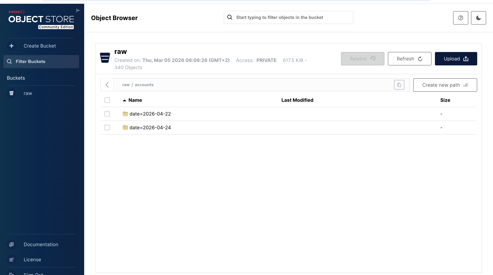
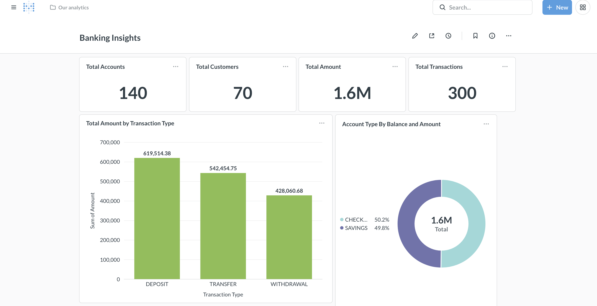
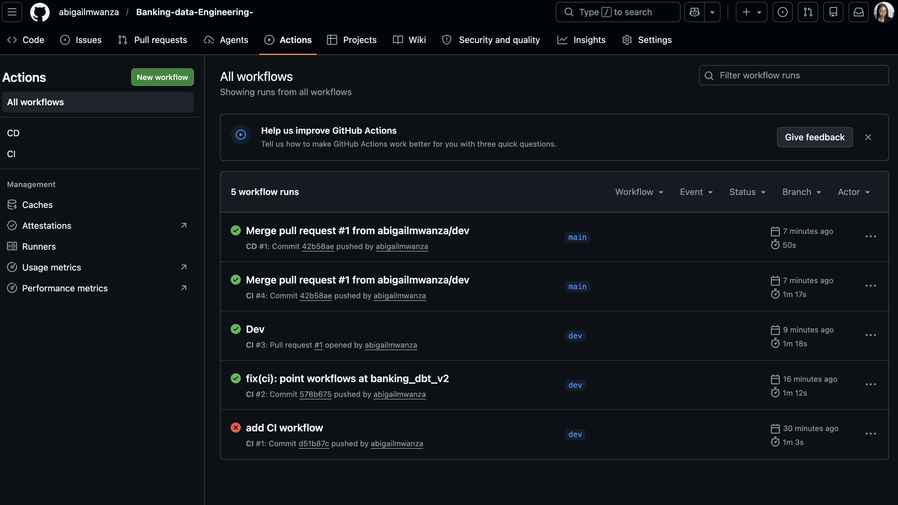

# Banking Data Engineering Pipeline — Real-Time CDC to Analytics

## 1. Overview

This project demonstrates a modern, event-driven data pipeline for a retail banking domain. Transactions generated in a PostgreSQL OLTP database are captured via Change Data Capture (CDC), streamed through Kafka, persisted as Parquet files in object storage, and loaded into Snowflake for analytical processing and transformation with dbt.

The design mirrors the architecture used by banks and fintechs to deliver sub-minute analytics, regulatory reporting, and fraud detection.

### In Simple Terms — What This Does for a Bank

Every time a customer deposits, withdraws, or transfers money, the bank's database records it. Most banks only look at this data the next day, after reports have been generated overnight. By then, it is already too late to catch fraud or answer a manager's question.

This project fixes that problem. Here is what it does, in plain language:

- **It watches the bank's database every second.** The moment a new transaction happens, this pipeline sees it — no waiting for end-of-day reports.
- **It sends the information to a safe storage area.** Every transaction is copied out of the main banking system so reports and analysis do not slow the bank down.
- **It keeps a permanent record.** Every deposit, withdrawal, and transfer is saved as a file that can never be changed — this is what regulators like the Bank of Zambia require.
- **It loads the data into a place where anyone can ask questions.** Managers, auditors, and analysts can run reports in seconds instead of waiting days.
- **It catches problems early.** Suspicious activity — like someone withdrawing large amounts in different towns at once — can be flagged straight away instead of next week.
- **It turns the data into pictures.** Charts and dashboards (Metabase) let managers see what's happening at a glance — total deposits today, transaction trends, account mix — without writing a single line of code.
- **It works automatically.** Once running, the pipeline does everything by itself: capture, move, store, load, visualize. No one has to press a button.

**The short version:** this project turns a bank's raw transaction data into clean, trustworthy, real-time information that can be used for fraud detection, regulatory reporting, customer insights, and business decisions — without slowing down the bank's main systems.


---

## Table of Contents

1. [Overview](#1-overview)
2. [Architecture](#2-architecture)
3. [Data Modeling — From OLTP to OLAP](#3-data-modeling--from-oltp-to-olap)
4. [Pipeline in Action](#4-pipeline-in-action)
5. [CI/CD — Automated Testing & Deployment](#5-cicd--automated-testing--deployment)
6. [Technology Choices](#6-technology-choices)
7. [Tech Stack](#7-tech-stack)
8. [Project Structure](#8-project-structure)
9. [Getting Started](#9-getting-started)
10. [Business Applications — Zambian Banking Sector](#10-business-applications--zambian-banking-sector)

---
## 2. Architecture


*Visual overview — Postgres (with Faker as a generator) feeds Debezium, which streams CDC events into Kafka. A Python consumer lands them as Parquet in MinIO; Airflow orchestrates the `COPY INTO` load to Snowflake, dbt transforms the raw layer into marts, and Metabase renders the dashboards.

**Stages**

| # | Stage | Component |
|---|-------|-----------|
| 1 | Generate | Faker Python script writes synthetic customers, accounts, and transactions into PostgreSQL |
| 2 | Capture | Debezium reads the PostgreSQL WAL and publishes row-level change events to Kafka |
| 3 | Stream | Kafka distributes events across topics (one per table) |
| 4 | Land | Python consumer writes events to MinIO as Parquet, partitioned by table and date |
| 5 | Load | Airflow DAG runs every minute, bulk-loading Parquet files into Snowflake via `COPY INTO` |
| 6 | Transform | dbt models shape raw CDC data into staging views and analytics-ready marts |
| 7 | Visualize | Metabase queries Snowflake marts to render no-code dashboards for pipeline observability and business insight |

---

## 3. Data Modeling — From OLTP to OLAP

A modern banking pipeline serves two very different workloads, and they need two very different data shapes. This project takes the bank's source data, modeled for **transactions**, and reshapes it into a model designed for **analytics**.

|  | **OLTP — Source System** | **OLAP — Data Warehouse** |
|---|---|---|
| **System** | PostgreSQL | Snowflake |
| **Job** | Run the bank — record every deposit, withdrawal, transfer | Answer questions — totals, trends, fraud, compliance |
| **Optimised for** | Fast, safe writes (one row at a time) | Fast, wide reads (millions of rows aggregated) |
| **Schema style** | Normalized (3NF) | Dimensional (star schema) |
| **Why this shape?** | No duplicated data → no update anomalies | Few joins → fast queries for dashboards |

### 3.1 OLTP Design — PostgreSQL Source (Normalized)

The bank's source database is fully normalized: `customers`, `accounts`, and `transactions` live in separate tables linked by foreign keys. This is the right shape for a system that has to record events safely and consistently while the bank is operating.


*Source schema in PostgreSQL — `customers (1) ──< accounts (1) ──< transactions`. A customer can own many accounts; an account can have many transactions. Each piece of customer information is stored once and only once.*

**Why a normalized model fits the source:**
- **No duplicated data.** A customer's address lives in one row of `customers` — an update touches one place, never many.
- **Consistency under load.** Foreign keys and constraints stop concurrent writes from corrupting each other while deposits and transfers are being processed.
- **Small, fast writes.** Every transaction is a tiny `INSERT` — exactly what the Write-Ahead Log and Debezium are tuned for.

### 3.2 OLAP Design — Snowflake Warehouse (Star Schema)

In the warehouse, the same data is reshaped into a **star schema**: one fact table at the centre (`fact_transactions`) surrounded by descriptive dimension tables (`dim_customers`, `dim_accounts`). dbt builds these models incrementally from the raw CDC layer that lands in Snowflake.


*Warehouse schema in Snowflake — `fact_transactions` is the centre of the star, joined to `dim_customers` and `dim_accounts`. A question like "total deposits this month by account type" reads one fact table and one thin dimension — no chain of joins through a normalized schema.*

**Why a star schema fits the warehouse:**
- **Few joins → fast dashboards.** Most analytical questions are one fact + one or two dimensions, which Snowflake can answer in seconds even over millions of rows.
- **Business-friendly columns.** Analysts see `customer_name`, `account_type`, and balances directly — they don't need to memorise foreign keys or write five-table joins.
- **History via SCD Type 2.** The `dim_customers` snapshot keeps a row per change, so a transaction from last quarter is reported against the customer's address *at the time*, not today's — essential for accurate regulatory and audit trails.

### 3.3 The Bridge — How OLTP Becomes OLAP

| Step | What happens | Where |
|---|---|---|
| 1 | Every `INSERT` / `UPDATE` / `DELETE` is captured from the WAL | PostgreSQL → Debezium |
| 2 | Each row-change event is buffered and durably stored | Kafka |
| 3 | Events are written as Parquet, partitioned by table and date | MinIO (raw layer) |
| 4 | Parquet files are bulk-loaded into a raw schema | Snowflake `BANKING.RAW` |
| 5 | dbt models stage, join, and shape the raw rows into facts and dimensions | Snowflake `BANKING.MARTS` |
| 6 | Metabase dashboards query the marts | Snowflake → Metabase |

The end result: the bank's transactional system stays lean and fast, and analysts get a clean, query-friendly model purpose-built for reporting — without anyone running ad-hoc queries against the live banking database.

---

## 4. Pipeline in Action

The screenshots below walk through the pipeline end-to-end, using live data from a running environment. They follow the same order as the stage table in §2.

### 4.1 Source — PostgreSQL (OLTP)

Faker continuously writes synthetic `customers`, `accounts`, and `transactions` into the PostgreSQL source database. Every `INSERT` / `UPDATE` / `DELETE` is recorded in the Write-Ahead Log, which is what Debezium tails.


*`accounts` table in PostgreSQL — synthetic savings and checking balances in ZMW, timestamped at the millisecond level. The schema behind it is the normalized model shown in §3.1.*

---

### 4.2 Capture & Stream — Kafka Consumer → MinIO (Parquet)

The Python consumer subscribes to the Debezium topics (`banking.public.customers`, `banking.public.accounts`, `banking.public.transactions`), buffers messages, and uploads them to MinIO as date-partitioned Parquet files. Each line in the log below is one Parquet file landing in the raw zone.


*Consumer output — each `Uploaded 1 record to s3://raw/transactions/date=2026-04-22/...parquet` confirms a CDC event has been durably landed in object storage.*

---

### 4.3 Land — MinIO Raw Zone

MinIO acts as the immutable "raw layer" of the lakehouse. Data is partitioned by table and by `date=YYYY-MM-DD`, which keeps Snowflake `COPY INTO` scans cheap and gives auditors a replayable archive.



*The `raw/accounts/` prefix with Hive-style date partitions — 340 Parquet objects / 617.5 KiB after a short run.*

---

### 4.4 Orchestrate — Airflow DAGs

Two DAGs are registered: `minio_to_snowflake_banking` (every minute, loads Parquet into Snowflake) and `SCD2_snapshots` (daily, builds Type-2 history via dbt snapshots).


*Airflow home — both DAGs enabled, recent runs green, next run scheduled a minute out.*

---

### 4.5 Load — DAG Run: MinIO → Snowflake

The minute-level DAG has two tasks: `download_minio` pulls any new Parquet files, then `load_snowflake` executes a `COPY INTO` against the `BANKING.RAW` schema.


*Gantt-side green bars = successful runs each minute. Graph view shows the two-task DAG completing.*

---

### 4.6 Alerting — Email on Failure

When a task fails (e.g. a Snowflake stage is missing or a permissions issue surfaces), Airflow's `on_failure_callback` sends a formatted email with the DAG, task, execution time, attempt number, and the exception.


*Real alert captured during development — a Snowflake `SQL compilation error: Stage 'BANKING.ANALYTICS."%CUSTOMERS"' does not exist` was surfaced within seconds of the failure.*

---

### 4.7 Transform — dbt on Snowflake

Once raw CDC rows are in Snowflake, dbt shapes them into staging views and analytics marts. The query below is `fact_transactions.sql` — an incremental model joining `stg_transactions` with `stg_accounts` to attach `customer_id`, producing a clean, query-ready fact table.


*Preview of `fact_transactions` — each row is an enriched transaction with `customer_id`, amount, type, status, and load timestamp, ready for fraud, AML, or BoZ reporting queries.*

---

### 4.8 Visualize — Metabase Dashboard

The final layer is a self-service BI dashboard built in Metabase, connected directly to the Snowflake marts. The "Banking Pipeline Overview" dashboard surfaces what data has landed end-to-end — confirming all transaction types and account types are flowing through the pipeline cleanly, and giving managers a no-code way to explore the warehouse.



*Banking Pipeline Overview — total transaction value by type (deposit / transfer / withdrawal) alongside the account-balance mix between checking and savings, both queried live from the Snowflake marts.*

**What the dashboard tells us at a glance:**

- All three transaction types are landing in Snowflake (deposit, transfer, withdrawal) — confirms Debezium is capturing every variety, not silently dropping any.
- Net deposit flow is positive: deposits ($619K) > withdrawals ($428K) — the bank is gaining money on net.
- Both account types (checking, savings) are present in `dim_accounts` with clean numeric balances totalling $1.6M — the snapshot model is preserving state correctly and `COPY INTO` is preserving types properly.
- Transactions and balances are queryable end-to-end, proving the full pipeline (Postgres → Debezium → Kafka → MinIO → Snowflake → dbt) is operating as designed.

---

## 5. CI/CD — Automated Testing & Deployment

The pipeline isn't just orchestrated at runtime — the code that runs it is itself tested and deployed automatically. Two GitHub Actions workflows live in [.github/workflows/](.github/workflows/) and gate every change to the `dev` and `main` branches.

| Workflow | Trigger | What it does |
|---|---|---|
| **CI** ([ci.yml](.github/workflows/ci.yml)) | `push` to `dev`/`main`, or `pull_request` into `main` | Spins up a Postgres 15 service, installs dependencies, runs `ruff` lint + `pytest`, then `dbt deps` and `dbt compile` against Snowflake to validate every model before merge |
| **CD** ([cd.yml](.github/workflows/cd.yml)) | `push` to `main` only | Re-installs dbt, points at the `prod` target, and runs `dbt run` followed by `dbt test` so production marts are rebuilt and validated the moment a PR lands |

### 5.1 CI — Pull Request Validation

When a contributor opens a PR into `main`, the CI workflow runs the full validation suite. The PR cannot be merged until all checks pass — there's no path for a broken model or a failing test to reach `main`.


*PR #1 (`dev` → `main`) — both `CI / tests (pull_request)` and `CI / tests (push)` finished in under a minute, "All checks have passed", no merge conflicts. Branch is safe to merge.*

### 5.2 CD — Production Deployment on Merge

Once the PR is merged, the CD workflow fires on the resulting `push` to `main`. It deploys the dbt project against the production Snowflake target — `dbt run` rebuilds the marts and `dbt test` validates them — so the warehouse is always in sync with `main`.



*Actions tab — five recent runs across both workflows. The two top runs (`Merge pull request #1 from abigailmwanza/dev`) are CI #4 and CD #1 firing back-to-back on the same merge commit, both green. CI also runs on every `dev` push so feedback comes before the PR is even opened.*

### 5.3 Why this matters for a banking pipeline

- **No untested SQL touches Snowflake.** `dbt compile` in CI catches a broken `ref()` or a column rename before it can break a downstream dashboard.
- **Secrets stay out of the repo.** Snowflake account, user, password, and warehouse are injected from GitHub Secrets at run time — the same `profiles.yml` template renders for `dev` and `prod` targets.
- **Auditable deployments.** Every change to a production mart is traceable to a merged PR, a green CI run, and a CD run on a specific commit — exactly the chain of custody a regulator expects.
- **Fast feedback.** A push to `dev` runs the same lint + compile suite the PR will run, so contributors see failures in ~1 minute instead of waiting for review.

---

## 6. Technology Choices

Each tool in the stack was chosen for a specific engineering reason.

| Tool | Role | Rationale |
|------|------|-----------|
| **PostgreSQL** | Source OLTP database | Industry-standard relational DB with a logical Write-Ahead Log (WAL), enabling CDC without schema changes or application-level triggers. |
| **Faker** | Synthetic data generator | Produces realistic customer and transaction records in a continuous loop, replacing the need for a live banking source. |
| **Debezium** | Change Data Capture | Streams every `INSERT`, `UPDATE`, and `DELETE` from the WAL in near real time with no impact on source performance. |
| **Apache Kafka** | Streaming message broker | Decouples producers from consumers; durable, replayable topics ensure no event loss during downstream failures. |
| **Zookeeper** | Kafka coordination | Manages broker metadata and leader election for Kafka 7.x clusters. |
| **Python Consumer** | Kafka-to-MinIO bridge | Converts streaming JSON to columnar Parquet, partitioned for efficient warehouse ingestion. |
| **MinIO** | S3-compatible object storage | Cost-effective, scalable landing zone ("raw layer"); preserves a replayable archive of every event. |
| **Apache Airflow** | Workflow orchestration | Schedules, monitors, and retries the MinIO-to-Snowflake load; bridges streaming and batch layers. |
| **Snowflake** | Cloud data warehouse | Decouples storage from compute, scales elastically, and ingests Parquet natively via `COPY INTO`. |
| **dbt** | SQL transformation layer | Version-controlled, testable SQL models with built-in lineage and documentation. |
| **Metabase** | BI / dashboarding | Open-source visualization layer with native Snowflake support; lets analysts and managers explore marts without writing SQL. |
| **Docker Compose** | Local environment | One-command reproducible setup for all services across machines. |

---

## 7. Tech Stack

**Languages:** Python 3.11, SQL
**Data Platforms:** PostgreSQL 15, Snowflake
**Streaming:** Apache Kafka 7.4, Debezium 2.2, Zookeeper
**Storage:** MinIO (S3-compatible)
**Orchestration:** Apache Airflow 2.9
**Transformation:** dbt-snowflake
**Visualization:** Metabase
**Infrastructure:** Docker, Docker Compose

---

## 8. Project Structure

```
Banking-data-engineering/
├── docker-compose.yml           # Service definitions
├── postgres/
│   └── SCHEMA.SQL               # Source database schema
├── data-generator/              # Faker-based data producer
├── kafka-debezium/              # Debezium connector registration
├── consumer/                    # Kafka → MinIO Parquet consumer
├── docker/
│   └── dags/                    # Airflow DAG definitions
└── banking_dbt/                 # dbt transformation project
```

---

## 9. Getting Started

### Prerequisites
- Docker Desktop
- Python 3.11+
- A Snowflake account with a `banking.raw` schema

### Setup

```bash
# 1. Start all services
docker-compose up -d

# 2. Create the source schema
psql -h localhost -p 5435 -U postgres -d banking -f postgres/SCHEMA.SQL

# 3. Register the Debezium CDC connector
python kafka-debezium/generate_and_post_connector.py

# 4. Start the Kafka → MinIO consumer
python consumer/kafka_to_minio.py

# 5. Generate synthetic data
python data-generator/faker_generator.py
```

### Configure Snowflake

Add your Snowflake credentials to `docker/dags/.env`, then open Airflow at `http://localhost:8080` and enable the `minio_to_snowflake_banking` DAG.

### Configure Metabase

Open Metabase at `http://localhost:3000` and complete the first-run setup wizard. When prompted to add a data source, choose **Snowflake** and enter the same credentials used for the Airflow DAG (account, user, password, warehouse, database, role). Once connected, build dashboards directly against the dbt marts (`dim_customers`, `dim_accounts`, `fact_transactions`) using the no-code question builder.

---

## 10. Business Applications — Zambian Banking Sector

This architecture addresses concrete operational and regulatory needs within Zambia's financial services industry — commercial banks (Zanaco, FNB Zambia, Stanbic, Absa Zambia, Indo-Zambia) and mobile money operators (MTN MoMo, Airtel Money, Zamtel Kwacha).

### 10.1 Use Cases

| Use Case | Business Impact |
|----------|-----------------|
| **Real-time fraud detection** | Sub-second detection of anomalies such as simultaneous ATM withdrawals across cities, replacing next-day batch reviews. |
| **Bank of Zambia regulatory reporting** | Automated, auditable daily and weekly prudential returns — capital adequacy, large exposures, AML — eliminating error-prone spreadsheet workflows. |
| **AML and CTR compliance** | Automatic flagging and reporting of Currency Transaction Reports above the FIC threshold (ZMW 100,000). |
| **Mobile money reconciliation** | High-throughput reconciliation between mobile wallets and bank settlement accounts at millions of transactions per day. |
| **Agent banking analytics** | Per-agent float tracking, commission calculation, and activity monitoring for networks such as Zanaco Xpress and FNB Cash Plus. |
| **Cross-border remittance monitoring** | Transaction-level tagging of SWIFT and RTGS inflows from the UK, South Africa, and DRC for FX exposure and AML oversight. |
| **Financial inclusion insight** | Identification of dormant accounts in underbanked provinces (Luapula, North-Western) for targeted reactivation campaigns. |
| **Multi-currency support** | Native handling of `ZMW`, `USD`, `ZAR`, and `GBP` transactions for corporate and dual-currency deposit accounts. |
| **Core banking modernisation** | CDC-based data extraction from legacy cores (Flexcube, T24, Bankfusion) without impacting source systems — a low-risk modernisation pathway. |
| **SME credit scoring** | Clean transaction history feeds into credit models, addressing the gap left by limited credit bureau coverage in the SME segment. |

### 10.2 Why This Architecture Suits the Zambian Context

- **Resilient to low bandwidth** — Kafka buffering and MinIO batching tolerate intermittent connectivity between branches in remote provinces.
- **Cost-efficient** — Self-hosted MinIO combined with Snowflake's pay-per-query pricing minimises upfront capital expenditure.
- **Regulator-ready** — Immutable Parquet archives in MinIO satisfy BoZ and FIC record-retention requirements (minimum 10 years).
- **Skills-aligned** — Built on SQL and Python, the most widely available data skills in the Zambian market; avoids niche or proprietary tooling.

---
